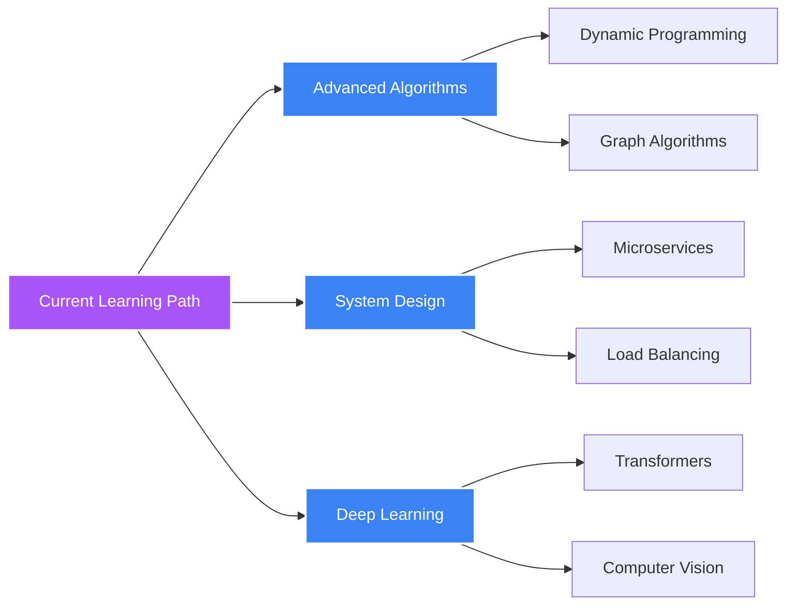

<div align="center">
  
</div>

<div align="center">
  
</div>

<div align="center">
  
  [](https://linkedin.com/in/pratham-sharma-9a15271b7)
  [](https://www.leetcode.com/user2217am)
  [](#)
  
</div>

<div align="center">
  
</div>

---

## 🚀 About Me


```typescript
const pratham = {
  title: "Full Stack Developer & ML Engineer 🚀",
  location: "Florida, USA 🇺🇸",
  education: "M.S. in Computer Science (University of Florida 🐊)",
  status: "Crafting scalable solutions & ML magic ✨",

  expertise: {
    frontend: ["React", "Next.js", "Vue", "Angular"],
    backend: ["Node.js", "Django", "FastAPI", "Spring Boot"],
    ml: ["TensorFlow", "PyTorch", "NLP", "Computer Vision"],
    cloud: ["AWS", "GCP", "Azure", "Docker", "Kubernetes"],
  },

  currentMission: [
    "🎯 Building production-ready ML systems",
    "⚡ Optimizing full-stack architectures",
    "🌟 Contributing to open source",
    "📚 Mastering system design patterns",
  ],

  philosophy: "Write code that speaks for itself 💻",
  superpower: "Debugging in production without breaking a sweat 😎",
  funFact: "I speak fluent JavaScript, Python, and Coffee ☕",
};

console.log("Let's build something amazing together! 🚀");
```

---

## 💻 Tech Arsenal

<details open>
<summary><b>🎯 Languages</b></summary>
<br>


</details>

<details open>
<summary><b>🎨 Frontend Development</b></summary>
<br>


</details>

<details open>
<summary><b>⚙️ Backend Development</b></summary>
<br>


</details>

<details open>
<summary><b>📱 Mobile & Cross-Platform</b></summary>
<br>


</details>

<details open>
<summary><b>🗄️ Databases</b></summary>
<br>


</details>

<details open>
<summary><b>🤖 Machine Learning & Data Science</b></summary>
<br>


</details>

<details open>
<summary><b>☁️ Cloud & DevOps</b></summary>
<br>


</details>

<details open>
<summary><b>🛠️ Tools & Others</b></summary>
<br>


</details>

---

## 📊 GitHub Analytics

<div align="center">
  
</div>

### 📈 Contribution Stats

<div align="center">
  
</div>

<div align="center">
  
  
</div>

<div align="center">
  
  
</div>

---

## 🏆 GitHub Achievements

<div align="center">
  
</div>

---

## 🐍 Contribution Snake

<div align="center">
  <picture>
    <source media="(prefers-color-scheme: dark)" srcset="https://raw.githubusercontent.com/PrathamSharma1510/PrathamSharma1510/output/github-contribution-grid-snake-dark.svg">
    <source media="(prefers-color-scheme: light)" srcset="https://raw.githubusercontent.com/PrathamSharma1510/PrathamSharma1510/output/github-contribution-grid-snake.svg">
    
  </picture>
</div>

> **Note:** To enable the snake animation, you need to set up a GitHub Action. See the [setup guide](GITHUB_PROFILE_SETUP.md#-contribution-snake-animation) for detailed instructions.

---

## 📚 Currently Learning

<div align="center">



</div>

---

## 💭 Dev Wisdom

<div align="center">
  
</div>

---

## 🤝 Let's Connect & Collaborate!

<div align="center">

I'm always excited to collaborate on innovative projects, especially those involving:

- 🌐 Full-Stack Web Applications
- 🤖 Machine Learning & AI Solutions
- 📱 Mobile App Development
- 🔗 Blockchain & Web3 Projects
- 🌟 Open Source Contributions

**Feel free to reach out for collaborations or just a friendly chat!**

[](mailto:your.email@example.com)
[](https://linkedin.com/in/pratham-sharma-9a15271b7)
[](https://twitter.com/yourhandle)

</div>

---

## 💡 Fun Facts

```python
fun_facts = {
    "favorite_language": "Python 🐍",
    "favorite_framework": "React ⚛️",
    "coding_style": "Clean Code Enthusiast",
    "coffee_consumed": "∞ cups ☕",
    "debugging_method": "console.log() & print() 🐛",
    "superpower": "Turning coffee into code ☕➡️💻",
    "currently_reading": "Designing Data-Intensive Applications 📚"
}

print(f"I believe in {fun_facts['coding_style']} and {fun_facts['superpower']}!")
```

---

<div align="center">
  
  ### 💡 *"First, solve the problem. Then, write the code."* – John Johnson
  
  ### 🌟 *"Code is poetry written in logic."*
  
  
  
  ⭐️ From [PrathamSharma1510](https://github.com/PrathamSharma1510) with 💜
  
</div>
